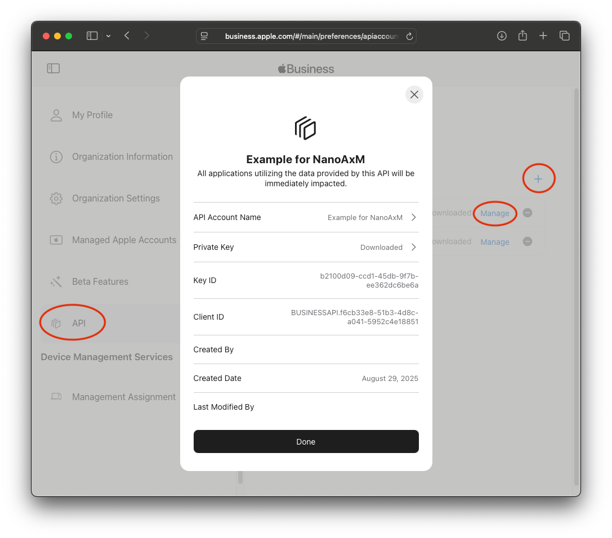
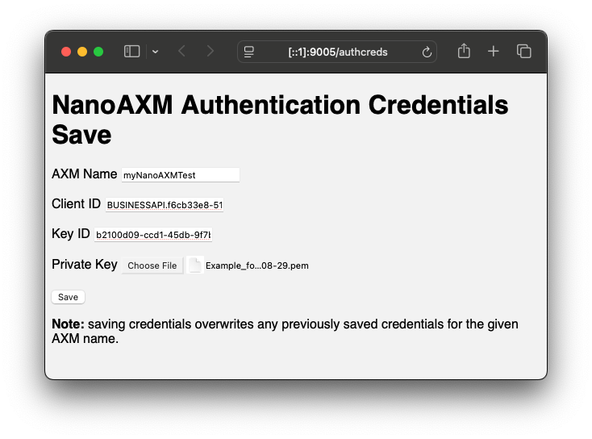

# NanoAXM Quick Start Guide

A guide to getting NanoAXM up and running quickly. For more in-depth documentation please see the [Operations Guide](operations-guide.md).

## Requirements

* An Apple Business Manager (ABM) or Apple School Manager (ASM) account.
* A browser with network access to the running NanoAXM server.
* For the [tools](../tools) you'll need `curl`, `jq`, and of course a shell script interpreter.
* Outbound internet access to talk to Apple's ABM or ASM APIs.

This guide assumes you'll run a local copy of the NanoAXM server for testing.

## Step 1: Download and start the NanoAXM server

First, get a copy of NanoAXM by downloading and extracting a [recent release](https://github.com/micromdm/nanoaxm/releases) or compiling from source. You'll also want to make sure you have `curl` and `jq` installed. As well you'll want to have the shell scripts from the [tools](../tools) directory downloaded and available. These are included in the release zips.

If compiling from source, issue a `make` to build the server. Otherwise launch the `nanoaxm-<platform>` binary:

```bash
$ ./nanoaxm-darwin-amd64 -api supersecret
2025/09/02 21:02:45 ts=2025-09-02T21:02:45-07:00 level=info msg=starting server listen=:9005 caller=main.go:121
```

Congrats, the server is now listening port 9005 waiting for connections. Once that's done...

## Step 2: Create an API account in ABM/ASM.

Next we'll acquire the API authentication credentials to talk to the ABM or ASM (AxM) APIs. To do that you'll login to Apple Business Manager or Apple School Manager then navigate to Preferences section (under your username in the lower left); the "API" section is in this submenu.

You'll need to create a new API account. You can name it however you like however we suggest keeping it the same as or similar to the "AxM name" you'll create with the NanoAXM server — mostly to avoid confusion. Once you've created the API account in ABM or ASM you'll need three things:

* The Client ID - a text string identifier you'll need to copy
* The Key ID - a text string identifier you'll need to copy
* The Private key - a PEM file that you download

To get these you can click on the 'Manage' link for each API account that has been created. Note you can only download a private key once. You can, however, revoke it if you need access to it again.

In ABM it looks a bit like this:



Once you have those...

## Step 3: Upload authentication credentials to NanoAXM

Next we'll want to upload our authentication credentials to NanoAXM so that it can authenticate to the ABM or ASM API. While the tools & scripts can do this, the easiest way to do this, to start with, is to use the upload HTML form. You can visit it following this link:

[http://[::1]:9005/authcreds](http://[::1]:9005/authcreds)

After authenticating to NanoAXM by using "nanoaxm" as the username and "supersecret" as the password (the API key) it should look like this:



Then you need to pick an "AxM name," paste in the Client ID and Key ID from the 'Manage' screen, above, as well as upload the downloaded private key and click 'Save.'

> [!WARNING]
> Using the form creates or *overwrites* any existing authentication credentials for the given "AxM name."

> [!WARNING]
> In our example the NanoAXM server is started as an HTTP server (not HTTPS) so the private key (and other bits) are transmitted in the clear. This is less important when running in a test against the localhost, but important to note for future deployments.

You can also upload the same data using one of the tools/helper scripts. That looks a bit like this:

```bash
export AXM_NAME=myNanoAXMTest
export BASE_URL='http://[::1]:9005'
export API_KEY=supersecret
$ ./tools/cfg-authcreds.sh BUSINESSAPI.f6cb33e8-51b3-4d8c-a041-5952c4e18851 b2100d09-ccd1-45db-9f7b-ee362dc6be6a ~/Downloads/Example_for_NanoAxM_2025-08-29.pem
Saved authentication credentials for AXM name: myAxmToken1 (Client ID BUSINESSAPI.f6cb33e8-51b3-4d8c-a041-5952c4e18851)
```

Which accomplishes the same thing as the 'Save' button on the HTML form, above, using `curl`. More on tools/scripts in the next section.

Once that's done...

## Step 4: Make your first query

First, and as per the [tools README](../tools/README.md) and the [Operations Guide](operations-guide.md) you need to setup some environment variables which the tools and helper scripts require:

```bash
# the URL of the running nanoaxm server
export BASE_URL='http://[::1]:9005'
# should match the -api switch of the nanoaxm server
export API_KEY=supersecret
# the AxM name (instance) you want to use
export AXM_NAME=myNanoAXMTest
```

> [!TIP]
> The `$AXM_NAME` and other envvars only need to be set once. If you already set them (for e.g. the example above) you can omit them for this step.

Once that's out of the way we're going to send our first query to list all the availble MDM servers in Apple Business Manager:

```bash
% ./tools/abm-mdmservers.sh 
{
  "data" : [ ... ],
  "links" : { ... },
  "meta" : { ... }
}
```

All of the `...`'s should be replaced with actual data assuming you have MDM servers configured in your ABM or ASM portal.

Congrats, you can talk to the ABM or ASM API!

## Next Steps

Now listing MDM servers as an example is fine, but you probably want to start doing some useful things. Here's a few ideas on where to proceed next:

* List device(s) in ABM or ASM.
  * First read the Apple docs for the [Get Organization Devices](https://developer.apple.com/documentation/applebusinessmanagerapi/get-org-devices) endpoint.
  * This will require using the proxy to query the e.g. `/proxy/business/$AXM_NAME/v1/orgDevices` URL path on the NanoAXM server.
* Re-assign devices from one MDM server to another.
  * The same process as above for the [Assign and Unassign](https://developer.apple.com/documentation/applebusinessmanagerapi/create-an-orgdeviceactivity) endpoint.
* Read the [Operations Guide](../docs/operations-guide.md) for more details on configuration, troubleshooting, etc.
* Setup more than one AxM name (API account) — with the tools and scripts this really just means changing the `$AXM_NAME` environment variable.
* A proper deployment
  * Behind HTTPS/proxies
  * Behind firewalls or in a private cloud/VPC
  * In a container environment like Docker, Kubernetes, etc. or even just running as a service with systemctl.
* Submit [PRs](https://github.com/micromdm/nanoaxm/pulls)!
